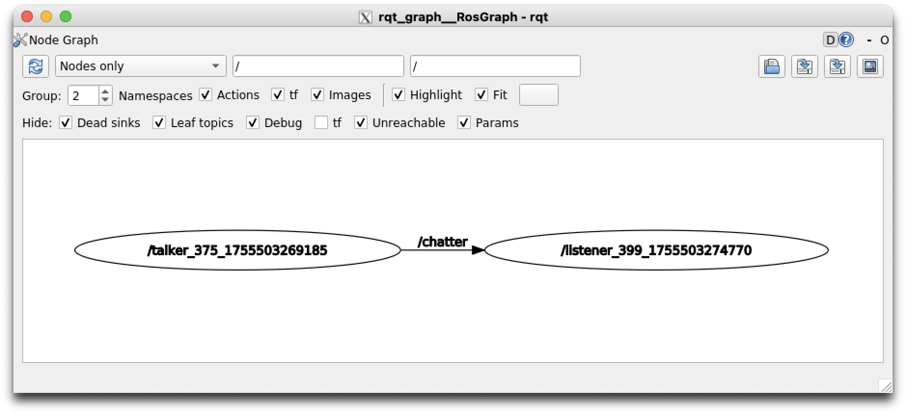

# ROS Basics

This repo contains example code for ROS 1, based on the book [Programming Robots with ROS]().

## Initial Setup

Start the ROS docker container:

```
docker compose run ros_ws bash
```

Create the workspace directory structure and boilerplate:

```
source /opt/ros/noetic/setup.bash
cd /workspace
mkdir -p src
cd src
catkin_init_workspace
cd ..
catkin_make
source devel/setup.bash
```

## General Usage

Once a workspace has been created, just load environment variables:

```
source /opt/ros/noetic/setup.bash
source devel/setup.bash
```

## Talker

The first example covers basic communication via a topic, and allows us to try some diagnostic tools. This example requires 4 terminal windows.

Start by running `roscore` in terminal 1:

```
roscore
```

Then, in terminal 2:

```
rosrun rospy_tutorials listener
```

Finally, in terminal 3:
```
rosrun rospy_tutorials talker
```

### `rostopic`

ROS allows topics to be inspected at runtime, using `rostopic`. This includes various subcommands, that will be listed by default:

```
rostopic is a command-line tool for printing information about ROS Topics.

Commands:
	rostopic bw	display bandwidth used by topic
	rostopic delay	display delay of topic from timestamp in header
	rostopic echo	print messages to screen
	rostopic find	find topics by type
	rostopic hz	display publishing rate of topic
	rostopic info	print information about active topic
	rostopic list	list active topics
	rostopic pub	publish data to topic
	rostopic type	print topic or field type

Type rostopic <command> -h for more detailed usage, e.g. 'rostopic echo -h'
```

To list the currently available topics, run `rostopic list`:

```
/chatter
/rosout
/rosout_agg
```

To see the messages for a specific topic (e.g. `/chatter`), run `rostopic echo /chatter`:

```
data: "hello world 1755503120.8789487"
---
data: "hello world 1755503120.9775074"
---
data: "hello world 1755503121.0761817"
...
```

### `rqt_graph`

ROS includes a Qt-based graph visualizer, which can be started with `rqt_graph`:



### `roslaunch`

An alternative to all of this is to use `roslaunch`, which can launch multiple ROS nodes at once.

First, shutdown the `rosrun` instances in terminal 2 and 3. Then run:

```
roslaunch rospy_tutorials talker_listener.launch
```

The output of both processes will be interlaced:

```
[INFO] [1755503649.738195]: hello world 1755503649.7374332
[INFO] [1755503649.743850]: /listenerI heard hello world 1755503649.7374332
[INFO] [1755503649.838976]: hello world 1755503649.8382878
[INFO] [1755503649.844799]: /listenerI heard hello world 1755503649.8382878
[INFO] [1755503649.938977]: hello world 1755503649.9383001
[INFO] [1755503649.945015]: /listenerI heard hello world 1755503649.9383001
```

The `roslaunch` command will also start `roscore` if it has not been started already.
